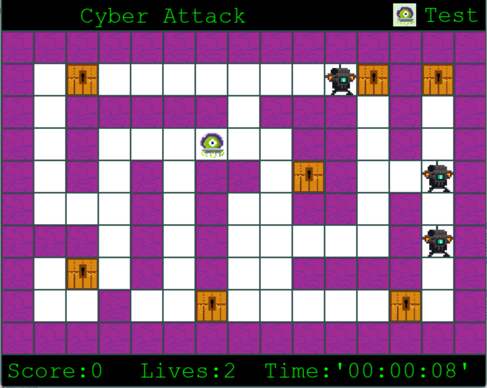
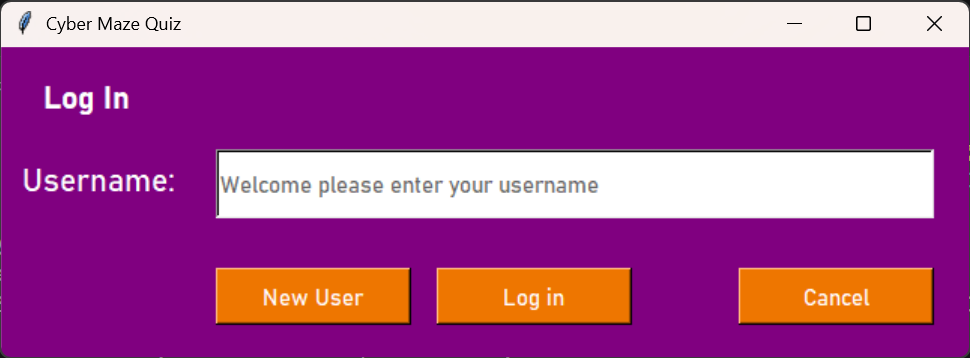

# Cyber Maze Quiz

## Overview

Cyber Maze Quiz is a maze-based educational game where players navigate mazes and answer quiz questions to progress. The application includes user management, score tracking, leaderboards, and administrative tools for managing game content.

---

## Screenshots

### Gameplay



### Login Screen



---

## Requirements

- Python 3.10 (developed and tested with Python 3.10.11)
- Python 3.12 may work
- Python 3.14 currently causes issues with some dependencies.

  ---

## Install Dependencies

Install the required dependencies:

```bash
pip install pygame
pip install pygame-widgets
pip install pillow
```

or use:

```bash
pip install -r requirements.txt
```

---

## Project Structure

```text
Maze-Game-wQuiz/
│
├── interfaces.py
├── callbacks01.py
├── PlayGame01.py
├── LogOnDataBase.py
│
├── Images/
│   ├── Wall.png
│   ├── Clue.png
│   ├── Spy.png
│   ├── Avatar01.png
│   ├── Avatar02.png
│   ├── Avatar03.png
│   ├── Avatar04.png
│   └── ...
│
├── Game_text_files/
│   ├── Maze1.txt
│   ├── Cyber.txt
│   └── ...
```

---

## Running application

Run:

```bash
python interfaces.py
```

or 

```bash
py -3.10 interfaces.py
```

`interfaces.py` is the main entry point for the application.

---

## Notes

> **WARNING**
>
> Do not resize the GUI window. The interface was originally designed as part of an A-Level project and does not support dynamic resizing.

---

## Technologies Used

- Python
- Tkinter
- SQLite
- Pillow (PIL)
- Pygame
- Pygame Widgets

---

## Features

- User account management
- Avatar selection
- Maze-based gameplay
- Question and clue system
- Leaderboards and score tracking
- Difficulty selection
- Admin tools for managing game content
- Local SQLite database storage

## Status

This repository contains the original coursework submission and is no longer actively maintained. It is shared for educational and portfolio purposes.

Developed by **F1shG3ck0**
